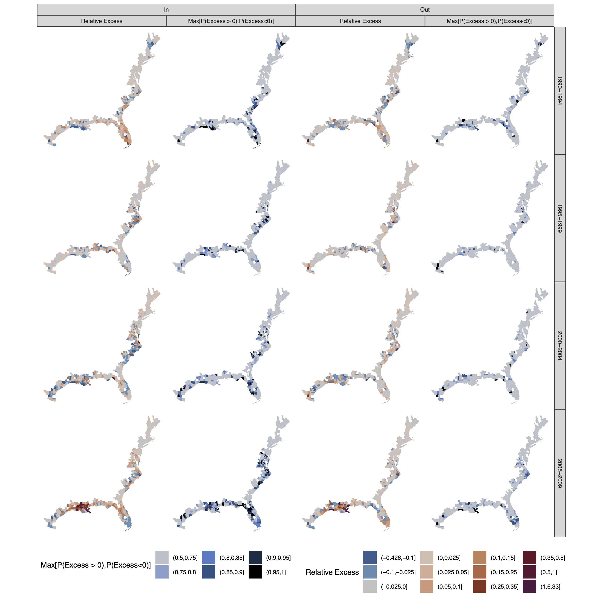

<style type="text/css">
  .reveal p {
    text-align: left;
    font-size: 0.7em;
  }
  .reveal ul {
    display: block;
    font-size: 0.7em;
  }
  .reveal ol {
    display: block;
    font-size: 0.7em;
  } 
  .reveal section img {
    border: none;
    box-shadow: none; 
  }
</style>

```{r setup, echo=F}

options(scipen = 999)

knitr::opts_chunk$set(echo = T,
                      message = F,
                      warning = F,
                      fig.align = 'center',
                      fig.height = 3,
                      fig.width = 5)

```

```{r, echo=F}

library(kableExtra)
library(bench)
library(tidyverse)

```

### What Is a Program?

In its essence, a program is a sequence of instructions that specifies how to perform a computation. 

Computations can be of different types:

- computing the mean of a set of numbers
- replacing the substring 'pre' with 'post' in a list of strings
- producing a graphic representation of some data

---

Every programming language has its own quirks but in general, every program (even the more complex ones) is a combination of a few basic instructions:

- **input**: Get data from the keyboard, a file, the network, or some other device.
- **output**: Display data on the screen, save it in a file, send it over the network, etc.
- **math**: Perform basic mathematical operations like addition and multiplication.
- **conditional execution**: Check for certain conditions and run the appropriate code.
- **repetition**: Perform some action repeatedly, usually with some variation.

## Coding Basics

The key building blocks of most languages are objects. In R, objects may be variables, arrays of numbers, character strings, functions, or more general structures built from such components. All R statements where you create objects, assignment statements, have the same form:

```{r, eval=F}
object_name <- value
```

Where `<-` is the assignment operator. This statement tells R that an object called `object_name` should be created and assigned the value `value`. A specific example could be:

```{r}
ourFirstString <- 'Hello World'
```

---

### Naming Conventions

It is a good practice to use descriptive names and a consistent style. People have their own taste. Some commonly used alternatives are:

```{r,eval=F}
iMostlyUseCamelCase
other_people_use_snake_case
some.people.use.periods
And_aFew.People_RENOUNCEconvention # Not recommended
```

You can inspect an object by typing its name:

```{r}
ourFirstString
```

---

*Exercise*

Try to create a new object called `myFirstObject` and assign it the value 5.4:

```{r,eval=F}
myFirstObject <- 
```

Then inspect it and check that everything worked as expected:

```{r,eval=F}
 
```
---

*Solution*

```{r}
myFirstObject <- 5.4
myFirstObject
```

---

### Types

Objects in R can be of different types (modes). The basic types of objects are:

- `numeric`, `integer` (no decimals) or `double` (with decimals)
- `logical` (TRUE or FALSE values)
- `character` (strings)

You can inspect an object's type by typing:

```{r}
typeof(myFirstObject)
```

---

A series of objects of the same type can be grouped into a `vector`. Vectors in R are defined as follows:

```{r}
myFirstVector <- c(1,2,5,7)
```

If you try to create a vector with objects of different types, R will try to coerce them to a common type:

```{r}
(illegalVector <- c(1,'3',5,FALSE))
```

In that case you'll need to use a list:

```{r}
myFirstList <- list(1,'3',5,FALSE)
```

---

Objects can be easily converted from one type to another (when it makes sense to do so). Here is an example:

```{r}
(z <- 0:9) # Parentheses will make R print the object
```

```{r}
(digits <- as.character(z))
```

A further coercion reconstructs the numerical vector:

```{r}
(d <- as.integer(digits))
```

---

### Functions

A special and very useful type of object is a *function*. As a general concept, a function takes some objects as inputs or parameters and uses them to complete an action or produce another object. For example, the `seq()` function takes three main arguments and returns the sequence of values from `from` to `to` in steps of length `by`.

```{r}
seq(from=1, to=5, by=1)
```

This works because `seq` belongs to the core of the R language.

---

You can define your own functions in the same way you create an object:

```{r,eval=F}
myFunction <- function(arg1 = val1, arg2 = val2, ...) {
  do_something(arg1,arg2)
}
```

For example, we can create a function that takes a vector of numbers and adds 2 to each of its elements:

```{r}
add2 <- function(numbers) {
  return(numbers + 2) # The return statement tells R to output the result
}

add2(1:4)
```
---

### Mathematical Operations

In our last example, you've seen how R can perform basic mathematical operations. Mathematical operators mostly work as expected:

```{r,eval=F}
 + # Addition 
 - # Subtraction 
 * # Multiplication 
 / # Division 
 ^ # Exponentiation 
 %% # Modulus
```
In addition to mathematical operators, R also has logical operators:

```{r,eval=F}
 & or && # AND 
 | or ||# OR 
 ! # NOT
```

---

*Exercise*

Try to define a function that takes the following vector of numbers as input and returns a vector in which each element has been divided by 2 and raised to the 2nd power:

```{r,eval=F}
numbers <- 1:5

divideBy2AndSquare <- function(numbers) {
   # write your code here
}
```

Now check that it produces the desired result:

```{r,eval=F}
divideBy2AndSquare(numbers)
```

---

*Solution*

```{r}
numbers <- 1:5

divideBy2AndSquare <- function(numbers) {
  return((numbers/2)^2)
}
```

Now check that it produces the desired result:

```{r}
divideBy2AndSquare(numbers)
```

---

### Conditional Execution

Often you need to perform one operation or another based on a given condition. This is what it is known as conditional execution. In R, you can implement it as follows:

```{r,eval=F}
if (someCondition) {
  executeThis()
} else {
  executeThat()
}
```

The expression or object that replaces `someCondition` must evaluate to either `TRUE` or `FALSE`.

---

Here is an example:

```{r}
season <- 'summer'
if (season == 'summer') {
  print('hot')
} else {
  print('cold')
}
```

---

Conditional expressions can also be chained:

```{r,eval=F}
if (someCondition) {
  executeThis()
} else if (someOtherCondition) {
  executeThat()
} else {
  executeSomethingElse()
}
```

or nested:

```{r,eval=F}
if (someCondition) {
  executeThis()
} else {
  if (someOtherCondition) {
    executeThat()
  }
}
```

---

*Exercise*

Write a function that computed the square root of a number if the number is strictly positive and the square root of its absolute value if it is negative:

```{r,eval=F}
computeSquare <- function(number) {
  if (someCondition) { # change the condition
    # write your code here
  } else {
    # write your code here
  }
}
```

Now check that it produces the desired result:

```{r,eval=F}
computeSquare(4)
computeSquare(-16)
```
---

*Solution*

```{r}
computeSquare <- function(number) {
  if (number > 0) {
    return(sqrt(number))
  } else {
    return(sqrt(abs(number)))
  }
}
```

```{r}
computeSquare(4)
computeSquare(-16)
```

---

### Loops and Repetition

Sometimes you need to repeat the same operation more than once with some variation. Here is an example:

```{r}
countdown <- function(n){
  while (n > 0) {
    print(n)
    n <- n - 1
  }
  print('Blastoff!')
}
countdown(3)
```

The `while` statement check if a condition is `TRUE` (here `n>0`) and keeps executing the code in curly brackets when (if ever) it turns `FALSE`. Make sure that you are not setting up an infinite loop!

---

A second alternative when you know exactly how many iterations you need to run is the `for` statement. Here is how we wuld rewrite the `countdown` function with a `for` loop.

```{r}
countdown <- function(n){
  for (i in n:1) {
    print(i)
  }
  print('Blastoff!')
}
countdown(3)
```

## A Brief Journey into the `tidyverse`

What we explored so far is part of the core R language. Indeed, we did not import any package. 

A package is a collection of functions pulled together by someone in order to perform a given set of operations. in R, packages are installed and loaded with the commands:

```{r,eval=F}
install.packages('packageName')
library(packageName)
```

Once a package is loaded, you can use its functions as if they were R core functions. If you want help with a function, you can type `?functionName` in our console to access its documentation.

---

There are many specialized packages in R, to build visualizations, to work with geographical data, to perform text analysis, etc.. Among R packages, the [`tidyverse`](https://www.tidyverse.org) collection stands out as coherent framework to perform all the most common data science operations, from reading the data, to cleaning it, to visualizing it.

Today, I'll be illustrating the following packages:

- `readr`: read and write data
- `dplyr` and `tidyr`: data wrangling
- `ggplot`: visualization
- `rmarkdown` and `knitr`: build smart documents

---

### `readr` Reading and Writing Data

`.csv` is by far the most common format for rectangular data. You can read `.csv` files into R as follows:

```{r,eval=F}
read_csv(pathToFile)
```

You can select which columns to read with the `col_select` option, specify column types with the `col_types` option, and specify a non standard delimiter with the `delim` option. 

`read_csv` is highly customizable and offers many useful options to take care of parsing problems. `readr` also offers the `read_fwf` function to read fixed width files (relatively common).

Once you have transformed the data you read and are satisfied with the result, you can write it to a file as follows:

```{r,eval=F}
write_csv(transformedData,pathToFile)
```

---

### `tidyr` and `dplyr` Transforming Data

Often, the data available to you is in a different format from the one you need. The `tidyverse` generally expects a dataset to follow these three principles:

There are three interrelated rules which make a dataset tidy:

1. Each variable must have its own column.
2. Each observation must have its own row.
3. Each value must have its own cell.

---

Consider the following table:

```{r, echo=F}
table2
```
This table violates rule 1 because two variables, `cases` and `population` share the same column.

---

We can easily convert the table to a tidy format with the following code:

```{r}
table2 %>%
  pivot_wider(names_from = 'type', values_from = 'count')
```

---

Imagine now that the data came as two separate tables:

```{r}
table4a # cases
table4b # population
```

---

Even in this case, we can easily create a tidy table. First, we need to collapse the different years into a unique variable:

```{r,results='hide'}
table4a %>%
  pivot_longer(`1999`:`2000`,
               names_to = 'year',values_to = 'cases')
table4b %>%
  pivot_longer(`1999`:`2000`,
               names_to = 'year',values_to = 'population')
```

---

and then we join them

```{r}
table4 <- table4a %>%
  pivot_longer(`1999`:`2000`,
               names_to = 'year',values_to = 'cases')
table4b %>% 
  pivot_longer(`1999`:`2000`,
               names_to = 'year',values_to = 'population') %>%
  left_join(table4,by=c('country','year'))
```

---

Other useful functions to transform datasets are:

- `separate`: to pull apart one column into multiple columns, by splitting wherever a separator character appears.
- `unite`: to combine multiple columns into a single column.
- `complete`: takes a set of columns, and finds all unique combinations. It then ensures the original dataset contains all those values, filling in where necessary.
- `fill`: takes a set of columns where you want missing values to be replaced by the most recent non-missing value.

---

*Exercise*

Consider this table:

```{r}
table3
```

Separate the `rate` variable into a `cases` and a `population` variable. Recall that you can look up the documentation for a function by typing `?myFunction`.

---

*Exercise (Continued)*

```{r,eval=F}
table3Tidy <- table3 %>%
  # Write your code here
```

And check if it worked:

```{r,eval=F}
table3Tidy
```

---

*Solution*

```{r}
table3Tidy <- table3 %>%
  separate(rate,into=c('cases','population'),sep='/')
```

And check if it worked:

```{r}
table3Tidy
```

---

Let us pause for a moment. In the code on the previous slides I've been frequently using the `%>%` operator. How does this work?

This pipe operator is implemented by the `magrittr` package and imported with the `tidyverse`. It passes the output of one operator or function to the next one as its first argument. Most `tidyverse` functions work very naturally with the pipe but other functions work as well with the following syntax:

```{r,eval=F}
firstObject %>%
  someFunction(someArg=.,otherArg1=arg1,otherArg2=arg2)
```

---

In one of the previous examples, I used the `left_join` function to combine two datasets through a common *key*. This is a very common operation and is implemented by the `*_join` family of functions.

- `inner_join`: keeps only entries found in both databases
- `left_join`: keeps only entries found in left database
- `right_join`: keeps only entries found in the right database
- `outer_join`: keeps any entry found in one of the two databases

You can specify which keys should be used for the join operation with the `by` parameter.

```{r,eval=F}
table1 %>%
  *_join(table2,by=c('var1a'='var2a','var1b'='var2b')) 
  # This is the most general syntax
```

---

Here is a graphic representation of what each `*_join` function does.


---

You'll often want to add, remove, reorder, or modify variables in a dataset. This is the job of `dplyr`.

- You can add new variables with the `mutate` function (`transmute` removes exisiting variables).
- You can select which variables you want to keep (or remove) with the `select` function.
- You can select which rows you want to keep with the `filter` function.
- You can reorder variables with the `relocate` function.
- You can sort a dataset with the `arrange` function.

---

Here is an example:

```{r}
table1 %>%
  mutate(rate = cases/population) %>% # we add a new variables
  filter(population > 100000000) %>% # keep if pop > 100 million
  relocate(year) %>% # we move year to the first position
  select(country,year,rate) %>% # we keep only year, country, and rate
  arrange(year,country) # we sort by year and country
```

---

The syntax of `select` is used in many other function throughout the `tidyverse`. It is thus worth it to explore it a little bit more:

- `var1:var2`: Selects all variables between var1 and var 2
- `var1,var3,...,var5`: Selects individual variables var1, var3, ..., var5
- `starts_with('someString')`: Selets all variables starting with someString
- `ends_with('someString')`: Selets all variables ending with someString

The `-` operator in front of any selection (i.e. `select(-selection)`) excludes the selected variables and keeps the remaining ones

---

*Exercise*

Starting from `table1`, keep only rows for Afghanistan, add a new variable called `rate` equal to the number of cases for 100,000 individuals and remove the `cases` and `population` columns.

```{r,eval=F}
table1 %>%
  # Write your code here
```

---

*Solution*

```{r}
table1 %>%
  filter(country == 'Afghanistan') %>%
  mutate(rate = (cases/population)*100000) %>%
  select(-c(cases,population))
```

---

Within `mutate` we can perform some clever operations taking advantage of `dplyr` functions.

```{r}
table1 %>%
  mutate(highPop = if_else(population > 100000000,T,F)) 
```
The `if_else` function select the first or the second input based on a condition. Here we create the `highPop` variable which equals to `FALSE` if the population is smaller than 100 million and `TRUE` otherwise.

---

When you have more than two cases, you should replace `if_else` with `case_when` instead of using nested clauses.

```{r}
table1 %>%
  mutate(popSize = case_when(population > 1000000000 ~ 'Very Large',
                             population > 100000000 ~ 'Large',
                             TRUE ~ 'Medium or Small')) 
```
`case_when` works like an `if` statement. Conditions are evaluated sequentially so you should move from the most specific to the most general condition. If none of the cases is matched, a `NA` value is returned. You can, however, use `TRUE` as the last condition to catch all the remaining cases.

---

If you need to perform the same operation on multiple variables, you can use the `across` function:

```{r}
table1 %>%
  mutate(across(cases:population, ~ .x/1000)) # divide by 1000
```

This may seem redundant here, but it becomes very useful when you have many variables.

---

### Grouped Data

Often you'll need to work with groups within the data. For example, you might want to compute the maximum number of cases by country. Within `dplyr`, you can do that with the `group_by` function.

```{r}
table1 %>%
  group_by(country) %>%
  mutate(maxCases = max(cases)) %>%
  ungroup() # we remove the grouping
```

---

If you want to compute a summary of the data by group and then preserve only one observation for each group, you can replace the `mutate` function with `summarize`.

```{r}
table1 %>%
  group_by(country) %>%
  summarize(maxCases = max(cases)) %>%
  ungroup() # we remove the grouping
```

Notice that summarize removes all the other variables.

---

*Exercise*

Compute the average population by year and then filter the dataset so that only observations from the year with the highest average population. Then remove the intermediate variable you created to store the maximum population.

```{r,eval=F}
table1 %>%
  # write your code here
```

---

*Solution*

```{r}
table1 %>%
  group_by(year) %>%
  mutate(averagePop = mean(population)) %>%
  ungroup() %>%
  filter(averagePop == max(averagePop)) %>%
  select(-averagePop)
```

---

### Building Visualization with `ggplot2`

`ggplot2` is a general purpose library for visualizing data. The key principle of `ggplot2` is the idea of building up a plot by combining different layers, each responsible for a specific function. You can learn more about `ggplot2` philosophy [here](http://vita.had.co.nz/papers/layered-grammar.pdf) but it's probably best to start with an example. We will be using the following classic dataset:

```{r}
head(iris) # Returns the first 5 elements
```

---

We wish to plot sepal length against sepal width.

```{r}
ggplot(data=iris)+ # Notice that we use + and not the pipe %>%
  geom_point(mapping=aes(x=Sepal.Length,y=Sepal.Width))
```

We specify that the data we want to use is in the `iris` object. Then we add our first layer `geom_point` and tell `ggplot2` that `Sepal.Length` should be mapped to the x-axis and `Sepal.Width` should be mapped to the y-axis.

---

Congratulations! This is your first graph. Suppose we want to change point shape based on the species.

```{r}
ggplot(data=iris) + # Notice that we use + and not the pipe %>%
  geom_point(mapping=aes(x=Sepal.Length,y=Sepal.Width,
                         shape=Species))
```

We just need to map the `Species` variable to the shape aesthetic.

---

If we felt that the shape alone is not enought to help the viewer separate points by species, we could add color:

```{r}
plot <- ggplot(data=iris,
               mapping=aes(x=Sepal.Length,y=Sepal.Width) )+
          geom_point(mapping=aes(shape=Species,color=Species)) 
plot
```

---

Suppose we want to focus on a specific portion of the graph:

```{r}
plot +
  coord_cartesian(xlim=c(6,7),ylim=c(2.5,3.5))
```

`coord_cartesian` controls the coordinates and can zoom on a part of the plot. Notice that we have stored our previous plot into the `plot` object and we are now adding more layers to it with the `+` operator.

---

We can change the axis labels and add a title:

```{r}
plot +
  labs(x='Sepal Length',
       y='Sepal Width',
       title='The Relationship of Sepal Width and Lenght')
```

---

We could also add a regression line:

```{r} 
plot +
  geom_smooth(method = 'lm', se = F,color='gray') 
```

---

Maybe it would be better to have each species in a separate graph:

```{r, fig.width=7}
plot +
  facet_wrap(~Species)
```

`facet_grid` allows to specify which variables should be used in the rows and which in the columns.

---

We are not confined to points. Here is a histogram of sepal length.

```{r}
ggplot(iris) +
  geom_histogram(mapping=aes(x=Sepal.Length),
                 bins = 10,color='black',fill='white')
```

---

There are many different geometries you can use:

- Lines: `geom_line`
- Boxplots: `geom_boxplot`
- Densities: `geom_density`
- Maps: `geom_map`
- Error Bars: `geom_errorbar`
- Uncertainty Intervals: `geom_ribbon`

and many more.

---

You can customize almost every aspect of a plot: axes, labels, grid lines, legend, orientation, size, palettes. However, `ggplot2` also offers a set of themes that modify several aspects of a figure at once:

```{r} 
plot +
  theme_minimal()
```

---

```{r} 
plot +
  theme_bw()
```

---

```{r} 
plot +
  theme_classic()
```

and more are available through the `ggthemes` package.

---

You can combine different geometries and other elements to build very complex visualizations. Here are two examples from my own research.




---

*Exercise*

Using the `iris` dataset, create a new graph with a different box plot of `Sepal.Width` for each Species. Label the axes in an appropriate way. Use the theme you prefer.

```{r,eval=F} 
ggplot(data=iris) +
  geom_*(mapping=aes(x=,y=)) +
  labs() +
  theme_*()
```

---

*Solution*

```{r} 
ggplot(data=iris) +
  geom_boxplot(mapping=aes(x=Species,y=Sepal.Width)) +
  labs(y='Sepal Width') +
  theme_bw()
```

---

### Communicating Your Results with RMarkdown

You might have noticed how this presentation combines formatted text, R code and plots. This presentation uses RMarkdown, a system integrated in RStudio that lets you write code through a notebook interface and create reproducible documents.

If you clone the repository where I uploaded this presentation's material you'll be able to recreate this document with a simple click of the "Knit" button in RStudio.

You have many different output types you can choose from: html, markdown, doc, pdf (through LaTex), and others.

You can learn more about RMarkdown functionalities [here](https://rmarkdown.rstudio.com/lesson-1.html).

---

### A Primer on Code Performance

You might be tempted to use `for` loops to repeat an operation on all elements of a set. However, this will likely prove to be slow. That's because in R (and many other languages) iterations in a `for` loops are executed sequentially even when the could be executed in parallel.

R makes is relatively easy to transform certain `for` loops into their *vectorized* equivalent (i.e. implemented in such a way that multiple iterations are run simultaneously). Suppose we want to compute the exponential of log of `x`*0.3 + 1 for all the elements of a vector. We could define a function to perform such operation on a single number:

```{r}
arbitraryOperation <- function(number) {
  trasformedNumber <- log(number*0.3 + 1)
  trasformedNumber <- exp(trasformedNumber)
  return(trasformedNumber)
}
```

---

We could then apply this function to the elements of our vector with a `for` loop as follows:

```{r}
n <- 100
numbers <- seq(0,2,length.out=n)

result <- vector(mode = "list", length = n)
for(i in 1:n){
    result[[i]] = arbitraryOperation(numbers[i])
}
result <- as.numeric(result)

```

Alternatively, we could write a more compact expression using the `sapply` functional. This function applies a given function to all the elements of a vector and returns another vector. 

```{r, eval=F}
sapply(numbers,arbitraryOperation)
```

---

Because R is a smart language, many basic functions are automatically vectorized when applied over vectors. For example, the `exp`, the `+`, the `*`, and the `log` operations can all be applied directly to an entire vector (and our `arbitraryOperation` function inherits this property). Let us now compare the performance of these three alternatives.

```{r, echo=F}
mark(
  {
    result <- vector(mode = "list", length = n)
    for(i in 1:n){
      result[[i]] = arbitraryOperation(numbers[i])
    }
    result <- as.numeric(result)
  },
  sapply(numbers,arbitraryOperation),
  arbitraryOperation(numbers),
  iterations=100) %>%
  select(expression,median,mem_alloc) %>%
  mutate(expression=c('For Loop','Sapply','Vectorized')) %>%
  kable(col.names = c('Implementation','Median Execution Time','Memory Allocation')) %>%
  kable_styling()
  
```

With a vector of size 100, the `sapply` solution is about 30 times faster than the `for` loop and the vectorized version is about 29 times faster than the `sapply` solution. In general, if a vectorized version is available you should use it.

---

As a general note, you might not always care about performance. If you are not writing computationally intensive code, readability should be given a higher priority.

At the same time, R is not a fast language so if performance is key to your project, you might have to look [elsewhere](https://adv-r.hadley.nz/perf-improve.html#vectorise).